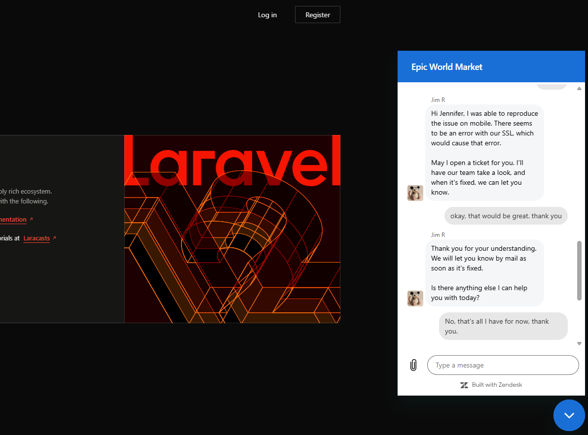

# laravel-sandbox

This project is a small sandbox application used to better understand how common user issues show up across different systems.

It is not a production app and is not meant to be deployed. Its purpose is to simulate real customer-facing issues.

Live sandbox URL:
https://sandbox.epicworldmarket.com/

The application intentionally mirrors situations where users:
- can’t log in
- don’t understand what they’re seeing
- believe something is broken
- reach out to support for clarification or help

## Support Tooling and Context

This sandbox also reflects a typical customer support environment.

- Customer conversations are handled through **Zendesk Messenger chat**
- Issues that require follow-up or investigation are tracked in **Jira**
- The goal is to understand how user-reported problems move from:
  - a chat message
  - to a support ticket
  - to internal investigation or escalation

This reinforces thinking in terms of:
- user symptoms
- clear communication
- actionable information for the next team

## Why This Project Exists

Support teams deal with the same customer problems no matter what technology is used underneath.

This sandbox exists to compare how things like:
- logins
- sessions
- access control
- unexpected logouts

behave in a different backend environment.

The goal is not to build features, but to recognize patterns that show up in support tickets.

## What This Helps Me Do (Support Perspective)

Working with this sandbox helps me:

- Recognize login and session issues regardless of framework
- Understand that user complaints are often the same across systems
- Separate “account problems” from “UI problems”
- Avoid assuming a problem is framework-specific

From a support standpoint, this builds confidence in diagnosing issues without relying on one stack.

## How This Relates to Real Support Work

Customers don’t care what framework is used.
They report symptoms.

This project reinforces that:
- The same issues appear in different systems
- The same questions need to be asked
- The same reasoning process applies

That mindset is more important than knowing any single tool.

## Relationship to Other Projects

This sandbox is a standalone environment separate from my other training apps.

## Status

This is an ongoing sandbox project.

It exists to build familiarity with how systems behave when things break, and to strengthen ticket triage and issue diagnosis relevant to application support and analyst roles.
